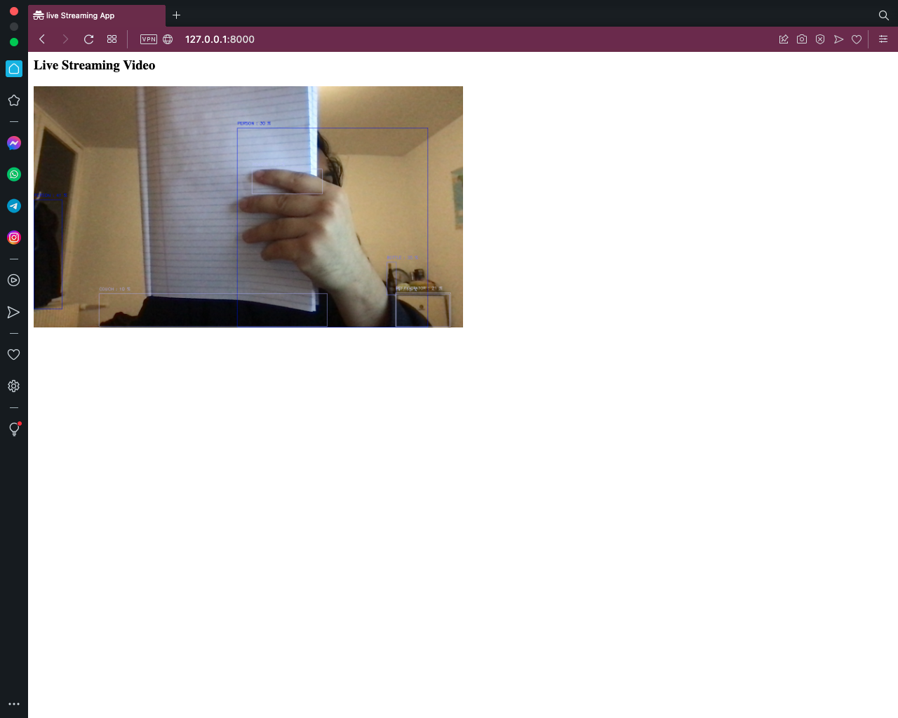

## Streaming Video from webcam using fastapi and object detection using yolov5

Video is streamed in the webpage using Fastapi. Object is detected for each frame using yolov5. For each detected frame, detected object is enclosed in a bounded box and prediction score is also printed on the frame.

To run the project: 
1. pull the repository and `cd` inside the repository-folder
2. create a virtual environment, activate the virtual-environment and do `pip install -r requirements.txt`.
3. To test if the streaming would work, you can run `python -m streamer_app.test_streamer.video_streamer`. This will run video streaming from webcam (camera_index = 0) in new window. You can quit the running window by pressing q.
4. For streaming the project in browser and object detection, you need to run `python -m streamer_app.main`
5. The above step will run a local server and serve in the port number 8000. You can click http://127.0.0.1:8000 to view in browser. If it doesnot works in your current browser, visit the link with a different browser application.
6. You can quit the running program from terminal by using `Ctrl + C`
7. The project uses yolov5 for object detection and utilizes `cpu` for detection. If your system supports CUDA i.e. has nvidia gpu then you can run the object detection faster utilizing the gpu. To do so, you need to change the configuration inside `streamer_app/configs/yolo_config.json` and change the computing device to `gpu`
8. To run inside a docker container, you can do `docker-compose up --build`. This will build a container and run it. Your application would be serve at the same link as above. Note: `In mac os and might be in windows os, I am not able to see the streamed video when using docker because of some issue with connecting with host-webcam from inside the docker-container.`

Project Work:
- [x] Web Streaming App using Fastapi
- [x] Object detection in browser using yolov5
- [x] Implement the object detection project in container `done but not working for macos/windows - because of webcam access issue of host from container. `

### [#python]()  [#opencv]()   [#yolov5]()  [#fastapi]()  [#computer-vision]()

Output: 
